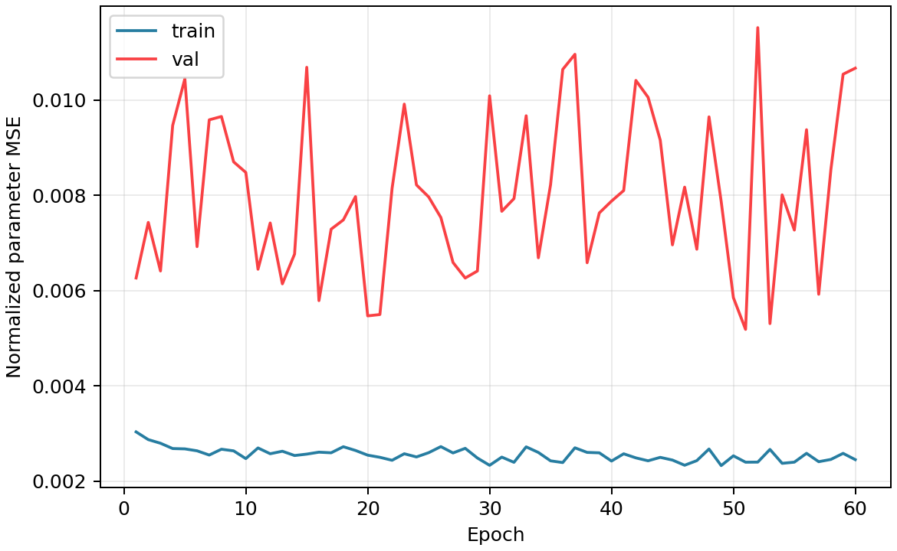

# LNO327 弱峰友好 CNN 反向拟合 baseline

数据集：`data/lno327_inverse_4d_wide_fwhm10_n512_q160_e180_h81_k121_l5.h5`

## 这是什么

这是一个小型 CNN 反向拟合模型。它不再把谱图简单展平，而是让卷积层去看峰的位置、峰形、峰宽和强度分布。

输入先做弱峰友好的强度压缩：每个样本按高分位归一化，然后做幂变换。这样强峰不会完全支配输入，弱峰和肩峰更容易被网络看到。

## 设置

- 输入模式：`residual4d`
- weak-peak percentile：`99.5`
- weak-peak gamma：`0.5`
- best epoch：`51`
- train/val/test：`358/77/77`

## 测试集误差

- overall MAE：`0.3348` meV
- overall RMSE：`0.8529` meV
- 平均 range-normalized MAE：`4.25%`

| 参数 | MAE (meV) | RMSE (meV) | R2 | MAE/范围 |
| --- | ---: | ---: | ---: | ---: |
| SJc | 1.168 | 1.87 | 0.956 | 3.90% |
| SJ1a | 0.147 | 0.1904 | 0.983 | 2.55% |
| SJ1b | 0.1903 | 0.2463 | 0.981 | 2.54% |
| SJ2 | 0.1481 | 0.2025 | 0.990 | 1.87% |
| SA | 0.02067 | 0.03608 | 0.604 | 10.41% |

## 论文参数谱的反推结果

| 参数 | 论文值 | CNN 反推 | 差值 |
| --- | ---: | ---: | ---: |
| SJc | 39.86 | 40.4 | +0.5403 |
| SJ1a | 2.36 | 2.418 | +0.05804 |
| SJ1b | 3.71 | 3.785 | +0.07497 |
| SJ2 | 4.63 | 4.641 | +0.01077 |
| SA | -0.07 | -0.05769 | +0.01231 |

## 图

## 怎么读

这个模型仍然是 baseline。它比 ridge 更重视图像结构；本次数据集样本数为 512。结果要看测试集泛化，而不是只看训练误差。如果测试误差没有明显下降，下一步应优先增加样本数、改进融合结构，或做敏感区域加权。
